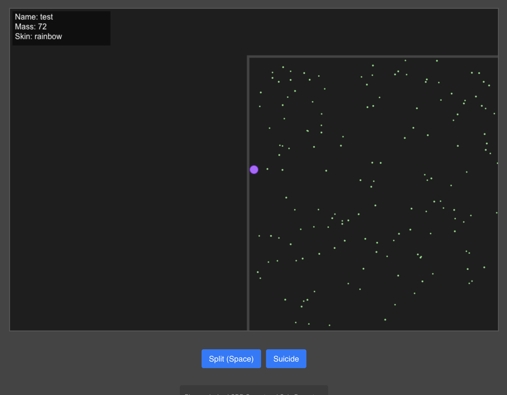
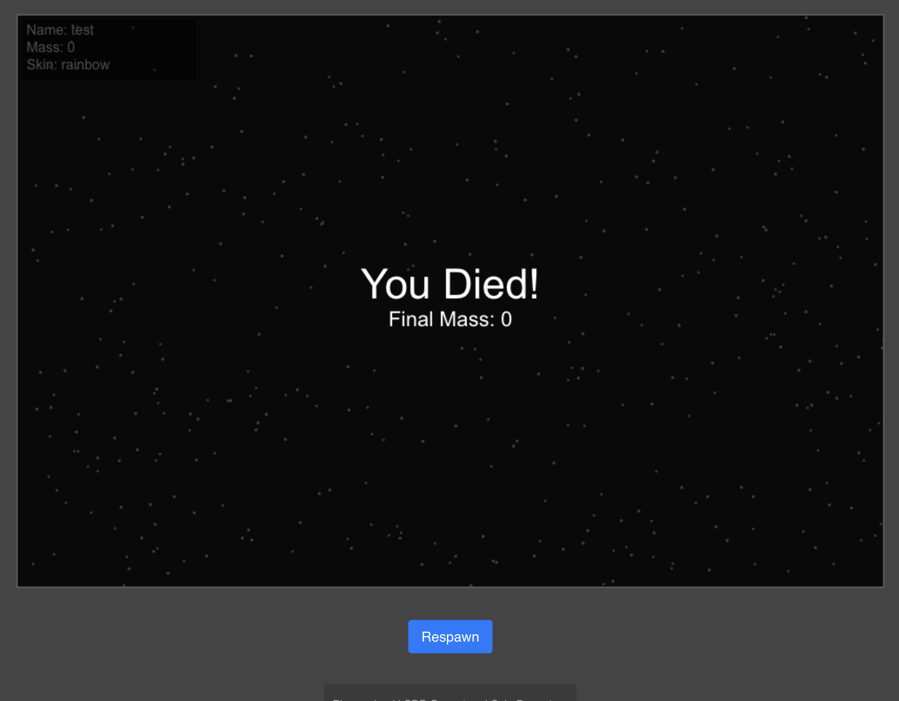
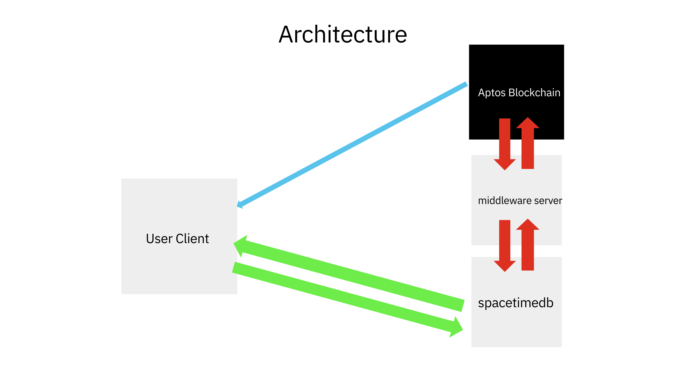

# MoveGameDB - A Massively Multiplayer Game with SpaceTimeDB and Aptos

## Demo Video
https://github.com/user-attachments/assets/5554a019-ae5d-4796-8650-3a08ba18c01d

[Link to uncompressed video](https://drive.google.com/drive/u/0/folders/1GFS2UCtK88MU6I7pRU8TnpHuRQ4pwQIR)





## Overview

MoveGameDB is a agario-like massively multiplayer proof of concept game that demonstrates the power of SpaceTimeDB for real-time game state management and Aptos blockchain for secure in-game item transactions. The game features ownable skins earned from increasing your all time high "mass", which is how big you are in agario.

## Project Structure

The project is organized into several key components:

### 1. SpaceTimeDB Backend (`/spacetime-agario`)
- Real-time game state management
- Handles thousands of concurrent player connections
- Manages game physics and player interactions
- Built with SpaceTimeDB's powerful distributed database system
- Ensures consistent game state across all connected players

### 2. Frontend (`/frontend-agario`)
- Built with React and TypeScript
- Real-time game rendering
- Responsive UI for game controls and player information
- WebSocket integration with SpaceTimeDB
- Smooth animations and particle effects

### 3. Middleware Server (`/middleware-server`)
- Custom rust server built from scratch
- Bridges communication between SpaceTimeDB and Aptos blockchain
- Subscribes to in game events through watching game updates in the SpaceTimeDB backend
- Updates user's skin ownership on the Aptos blockchain based on in game events

### 4. Aptos Smart Contract (`/contract`)
- Written in Move programming language
- Handles in-game skin ownership

## Running the project with Docker

Coming soon!

## Running the project manually (for development)

### Prerequisites
Install SpacetimeDB (needed to run the SpacetimeDB backend for the game): https://spacetimedb.com/install

Install Aptos CLI (needed to publish smart contract from command line, although you can do this through other methods without the CLI): https://aptos.dev/en/build/cli

Install pnpm (a fast node package manager, used to build and run the frontend) here: https://pnpm.io/installation

You will need a Aptos blockchain wallet with some testnet APT coins dedicated to deploying the smart contract and allowing the middleware server to submit transactions to the Aptos blockchain. You can create a Aptos wallet with the Petra browser extension. Download it here: https://chromewebstore.google.com/detail/ejjladinnckdgjemekebdpeokbikhfci?utm_source=item-share-cb 

Get testnet tokens here for your wallet here: https://aptos.dev/en/network/faucet

### 1. Publish the smart contract to the Aptos Blockchain. 
First, setup your Aptos CLI environment. Open a terminal in the cloned github repository and run:
```shell
cd contract
aptos init
```

The aptos init command will walk you through setting up a default profile. It is recommended to select the `testnet` as your network. You will then be prompted to paste the private key of your wallet in the terminal. Ensure you have already added testnet tokens to your wallet with the link provided above.

Now, we can deploy the smart contract. Run the following command, replacing YOUR_WALLET_ADDRESS with the address of the wallet you have been using so far:
```shell
aptos move publish --named-addresses player_skin_module_admin=YOUR_WALLET_ADDRESS
```

### 2. Next, run the SpacetimeDB server and the game backend. 
Ensure you have installed SpacetimeDB as instructed in the prerequisites. Open a new terminal and run:
```shell
spacetime start
```
Now, publish the SpacetimeDB backend to the SpacetimeDB server that you just ran. To do this, open a new terminal in the cloned github repository and run:
```shell
cd spacetime-agario
spacetime publish --project-path server-rust spacetime-agario
```
You have now published your game to the SpacetimeDB server with the module name `spacetime-agario`

### 3. Now, run the middleware server that connects the SpacetimeDB game backend to the Aptos blockchain. 
First, we need to set up our environment variables. Create a file named `.env` in the `middleware-server/` folder. Then, paste the following in:

```env
# Middleware server environment variables

SPACETIMEDB_URI="ws://localhost:3000" 
SPACETIMEDB_DB_NAME="spacetime-agario"

APTOS_NODE_URL="https://api.testnet.aptoslabs.com/v1"
CONTRACT_ADMIN_PRIVATE_KEY="0xYOUR_WALLET_PRIVATE_KEY" # Hex string of private key
CONTRACT_ADMIN_ADDRESS="0xYOUR_WALLET_ADDRESS" # Hex string, e.g., 0x...
PLAYER_SKIN_MODULE_ACCOUNT_ADDRESS="0xYOUR_WALLET_ADDRESS" # Address where ModuleOwner/SkinHolders live, typically same as admin
PLAYER_SKIN_MODULE_NAME="player_skins"
```
Replace `0xYOUR_WALLET_PRIVATE_KEY` and `0xYOUR_WALLET_ADDRESS` (appears twice) with your private and public key from your wallet.

Now, lets run the server. Open a new terminal in the cloned github repository and run:
```shell
cd middleware-server
RUST_LOG=info cargo run
```
This will compile and run the middleware server. Putting `RUST_LOG=info` before `cargo run` will give you more verbose logging about what the server is doing behind the scenes.

### 4. Lastly, run the webserver. 
First, create a file called `.env` under the `frontend-agario/` folder and paste in the following:
```env
VITE_SPACETIMEDB_URI="ws://localhost:3000"
VITE_MODULE_NAME="spacetime-agario" //name of the spacetimedb module you published
VITE_PLAYER_SKIN_MODULE_ADDRESS=0xYOUR_WALLET_ADDRESS
```

Replace `0xYOUR_WALLET_ADDRESS` with the wallet address you deployed the smart contract with in the previous step. 

Now, lets run the frontend. To do that, open a new terminal in the cloned github repository and run

```shell
cd frontend-agario/client
pnpm install
pnpm run dev
```

Visit the website at http://localhost:5173 and have fun!

## Contributing

Please submit any bugs through a github issue report. Otherwise, feel free to submit a pull request to contribute!

