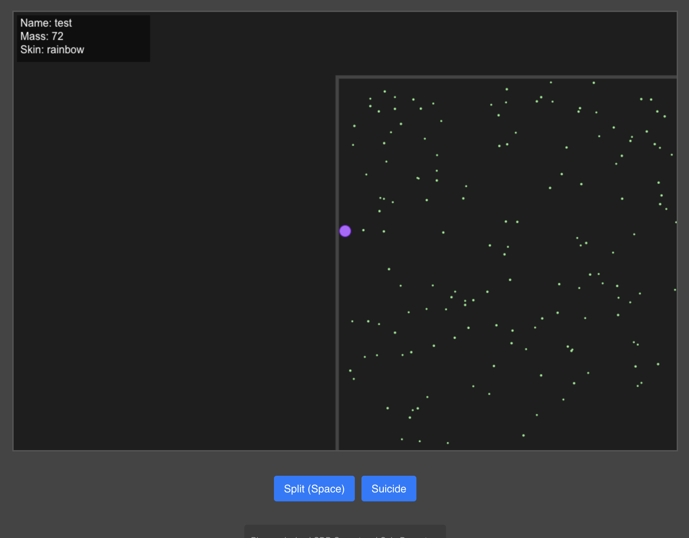
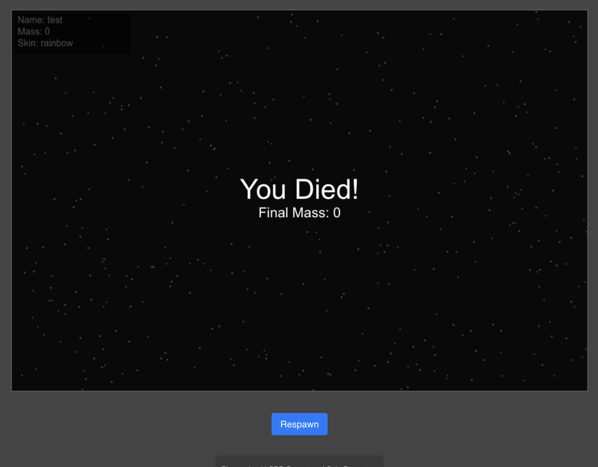
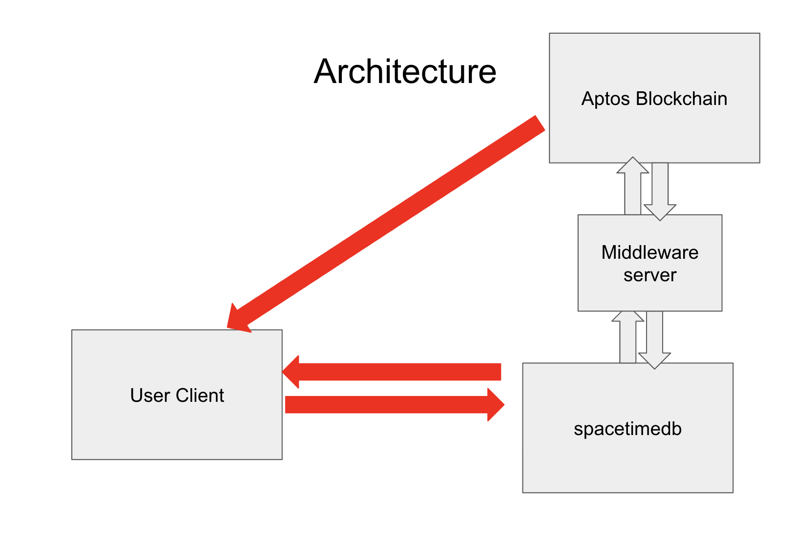

# MoveGameDB - A Massively Multiplayer Game with SpaceTimeDB and Aptos

## Demo Video
https://github.com/vpalmerio/MoveGameDB/raw/main/assets/submission.mp4

<video width="800" controls>
  <source src="assets/submission.mp4" type="video/mp4">
  Your browser does not support the video tag.
</video>





## Overview

MoveGameDB is a massively multiplayer game that demonstrates the power of SpaceTimeDB for real-time game state management and Aptos blockchain for secure in-game item transactions. The game features a space-themed environment where players can interact, collect items, and engage in various gameplay mechanics.

## Project Structure

The project is organized into several key components:

### 1. SpaceTimeDB Backend (`/spacetime`)
- Real-time game state management
- Handles thousands of concurrent player connections
- Manages game physics and player interactions
- Built with SpaceTimeDB's powerful distributed database system
- Ensures consistent game state across all connected players

### 2. Frontend (`/frontend`)
- Built with React and TypeScript
- Real-time game rendering
- Responsive UI for game controls and player information
- WebSocket integration with SpaceTimeDB
- Smooth animations and particle effects

### 3. Aptos Smart Contracts (`/contracts`)
- Written in Move programming language
- Handles in-game item ownership and transfers
- Manages player inventories and achievements
- Processes hundreds of concurrent item transactions
- Ensures secure and verifiable item ownership

### 4. Middleware Server (`/server`)
- Node.js/Express backend
- Bridges communication between SpaceTimeDB and Aptos blockchain
- Handles authentication and player sessions
- API endpoints for game services
- Transaction management and optimization

## Technology Stack

### SpaceTimeDB
- Distributed real-time database
- Horizontal scaling for massive player support
- Built-in conflict resolution
- Microsecond latency for real-time updates
- Automatic state synchronization across clients

### Aptos Blockchain
- Move-based smart contracts
- Parallel transaction execution
- High throughput for item transactions
- Built-in NFT support
- Secure and verifiable game assets

### Frontend Technologies
- React.js
- TypeScript
- WebGL/Three.js for rendering
- Web3.js for blockchain integration
- WebSocket for real-time communication

### Backend Technologies
- Node.js
- Express
- SpaceTimeDB SDK
- Aptos SDK
- WebSocket Server

## Key Features

1. **Massively Multiplayer Support**
   - Thousands of concurrent players
   - Real-time state updates
   - Seamless player interaction

2. **Blockchain Integration**
   - Secure item ownership
   - Tradeable in-game assets
   - Verifiable game achievements

3. **Performance Optimization**
   - Low-latency updates
   - Efficient state synchronization
   - Optimized resource usage

## Getting Started

1. Clone the repository
2. Install dependencies for each component
3. Set up SpaceTimeDB credentials
4. Configure Aptos network settings
5. Start the development servers

```bash
# Install dependencies
npm install

# Start SpaceTimeDB server
npm run spacetime

# Start middleware server
npm run server

# Start frontend development
npm run frontend
```

## Contributing

Contributions are welcome! Please read our contributing guidelines and submit pull requests for any enhancements.

## License

This project is licensed under the MIT License - see the LICENSE file for details.
